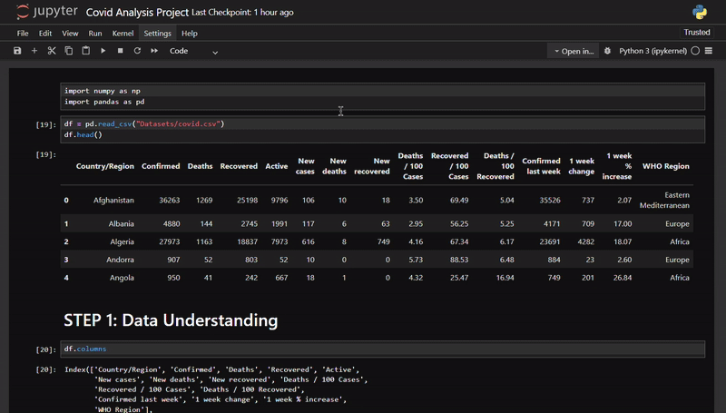

# 🦠 COVID-19 Data Analysis with Pandas

This project explores a global COVID-19 dataset using Python and Pandas, covering confirmed cases, deaths, recoveries, weekly trends, and WHO regional breakdowns.

## 📁 Dataset Overview

- **Source:** [COVID-19 Dataset from Kaggle](https://www.kaggle.com/datasets/imdevskp/corona-virus-report?select=country_wise_latest.csv)
- **Columns include:**
  - `country_region`: Country name
  - `confirmed`, `deaths`, `recovered`, `active`
  - `new_cases`, `new_deaths`, `new_recovered`
  - Weekly change & % increase
  - `WHO Region`
- Clean, tabular format with no missing values

## 🧼 Cleaning Tasks Performed

- Renamed and stripped whitespace from column names
- Verified calculated columns (e.g., `active = confirmed - deaths - recovered`)
- Checked for duplicates and fixed country name formatting
- Ensured all numeric columns were in proper types

## 🔍 Key Questions Answered

- ✅ What is the total number of confirmed cases, deaths, and recoveries globally?
- ✅ Which countries had the highest total cases, deaths, and recovery rates?
- ✅ Which countries had the **largest 1-week increase** in total cases?
- ✅ Which countries had the **highest 1-week % growth** in cases?
- ✅ Which countries recovered faster than they got infected this week?
- ✅ Which countries reported **0 deaths** — and what might that indicate?

## 📊 Tools Used

- Python
- Pandas
- Jupyter Notebook

## 🧠 Key Insights

- Some small nations had zero reported deaths, suggesting either excellent containment or underreporting
- Several countries showed a high weekly case growth %, even with small total case numbers
- Recovery > new cases in certain countries — signaling potential improvement

## 📁 File Structure

- `covid-analysis-project.pdf`: Clean analysis notebook with all code and insights
- `README.md`: Project summary

---

## ✍️ Author

**[Faizan Ahmed Khan](https://github.com/thedatafae)**  

